# Hospital Management System

A small hospital platform: patients book appointments, admins manage doctors
and the public site content. Three services — a FastAPI backend and two
React frontends — backed by Postgres.

## Architecture

```
     Patient                  Admin
        |                       |
        v                       v
┌────────────────┐      ┌────────────────┐
│ Patient Portal │      │  Admin Panel   │
│ React + nginx  │      │ React + nginx  │
│     :5174      │      │     :5173      │
└───────┬────────┘      └───────┬────────┘
        |      REST + JWT       |
        └───────────┬───────────┘
                    v
           ┌────────────────┐
           │ FastAPI :8000  │
           └────────────────┘
                    v
           ┌────────────────┐
           │ Postgres :5432 │
           └────────────────┘
```

Both frontends are static builds served by nginx — no server-side logic
lives there. The API is the only thing that touches the database.

In production this runs on Kubernetes behind Traefik (k3s's built-in
ingress controller), deployed via Jenkins → Docker Hub → ArgoCD, on AWS
infrastructure provisioned with Terraform. Locally it's just Docker
Compose.

## Screenshots

### Patient Portal

| Sign In | Sign Up |
|---|---|
| 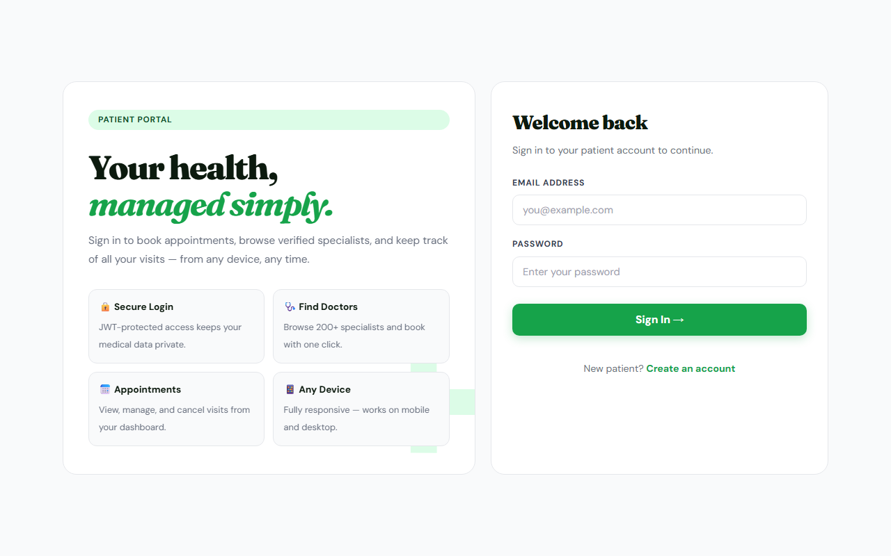 | 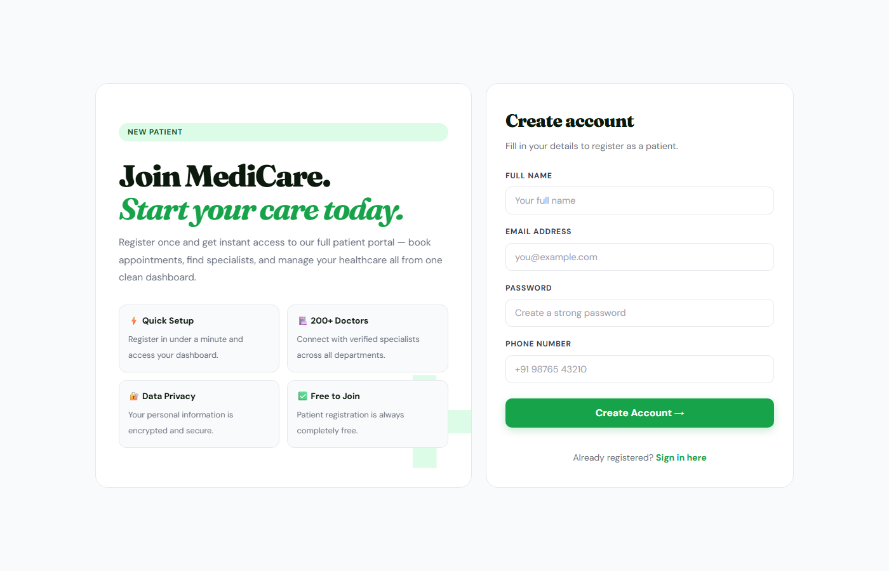 |

| Home | Find Doctors |
|---|---|
| 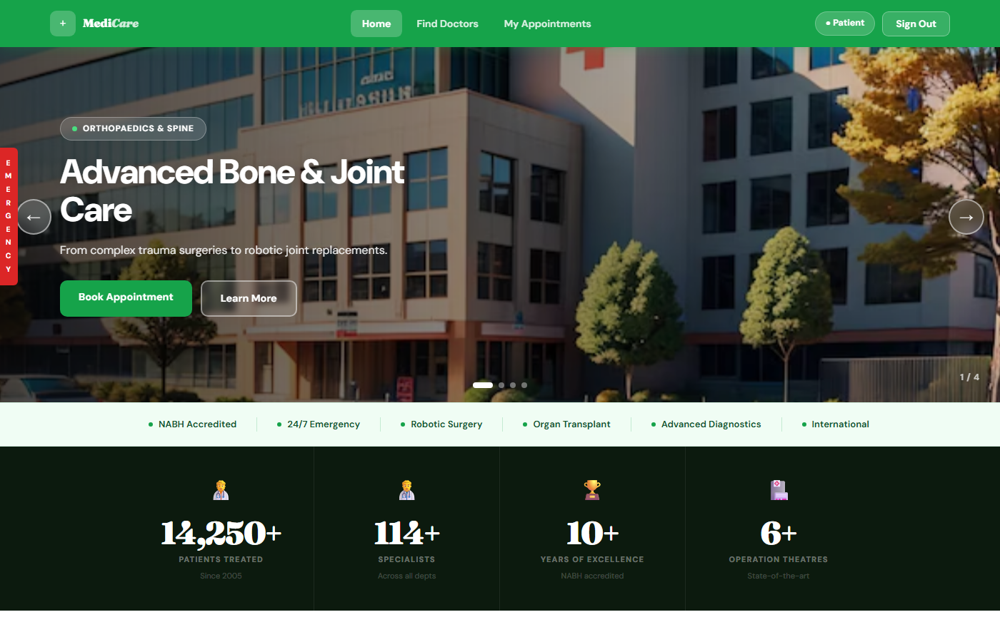 | 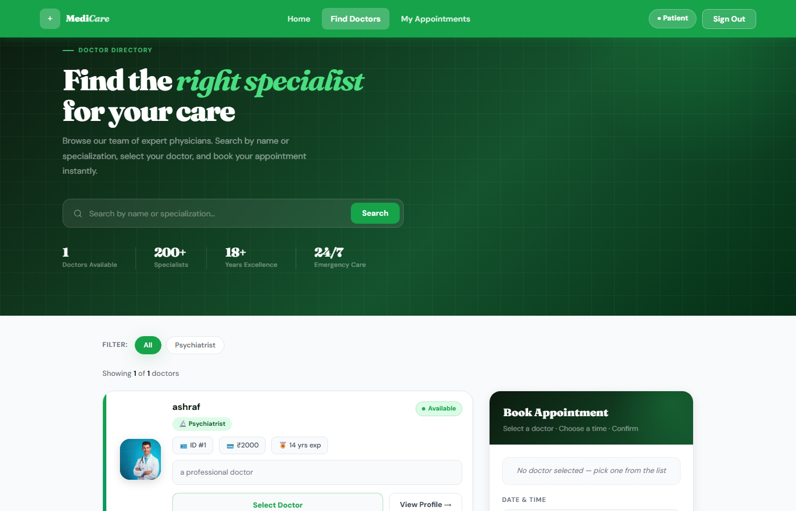 |

| Our Hospitals | My Appointments |
|---|---|
| 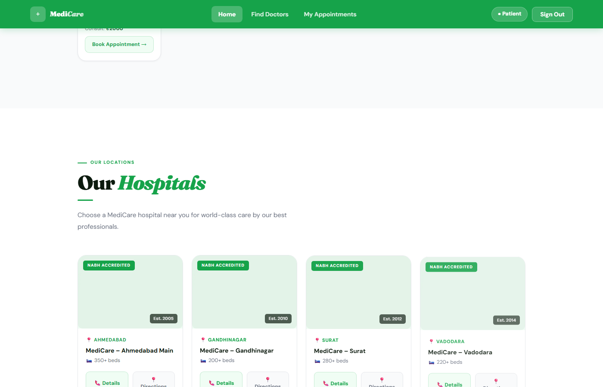 | 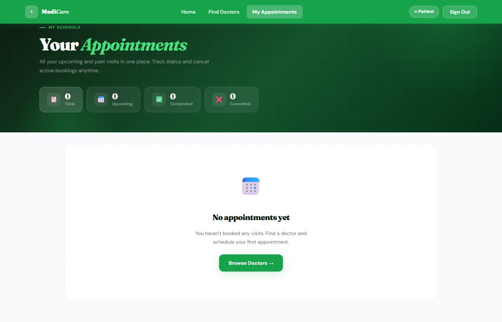 |

### Admin Panel

| Login | Dashboard |
|---|---|
| 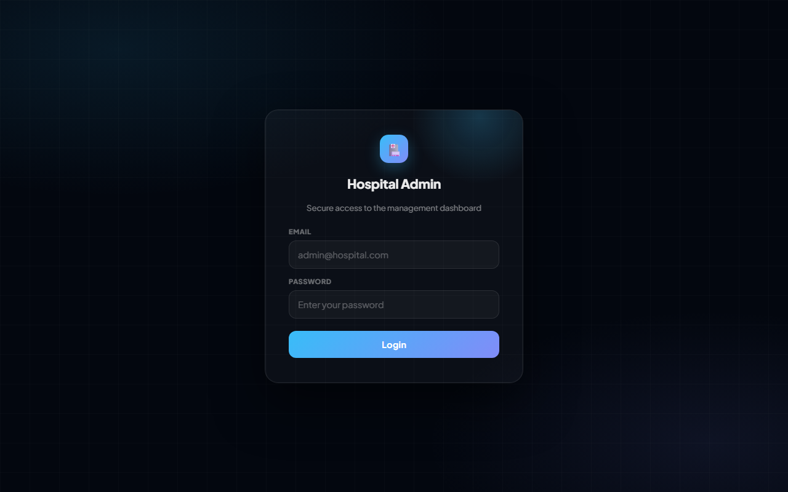 | 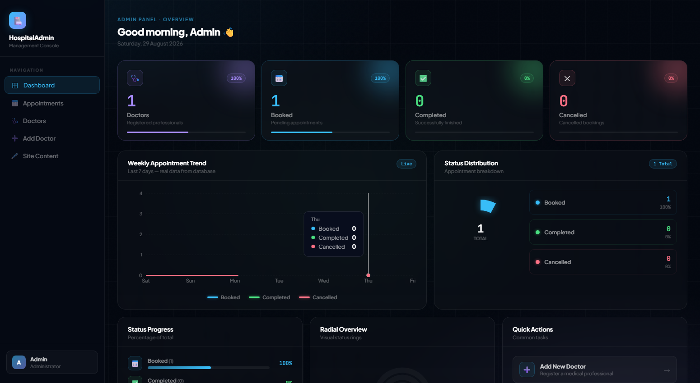 |

| Dashboard (Quick Actions) | Add Doctor |
|---|---|
| 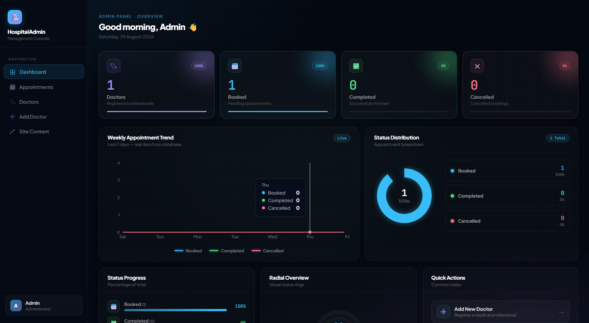 | 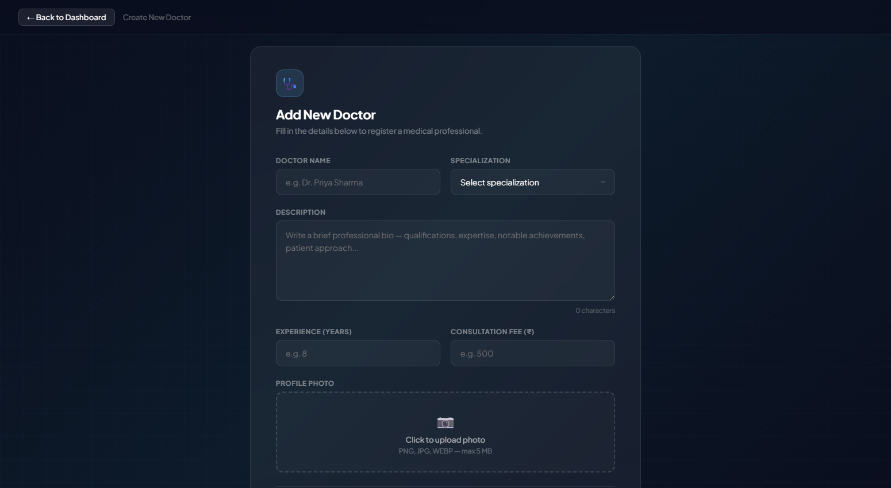 |

| Appointments | Appointment Detail |
|---|---|
| 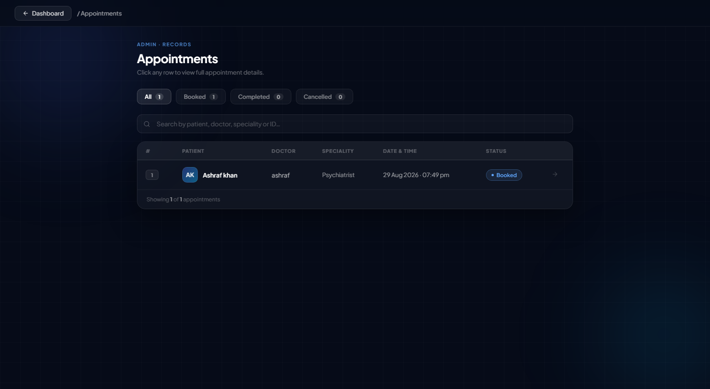 | 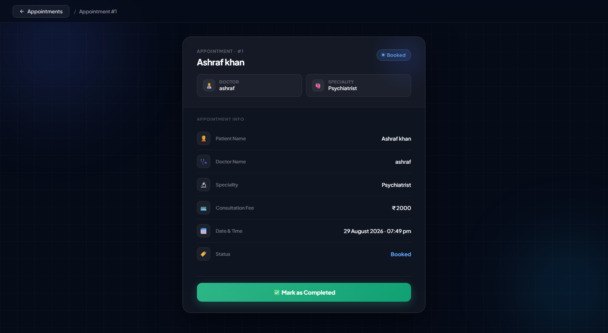 |

### CI/CD

| Jenkins — Pipeline Stages | Jenkins — Stage View |
|---|---|
| 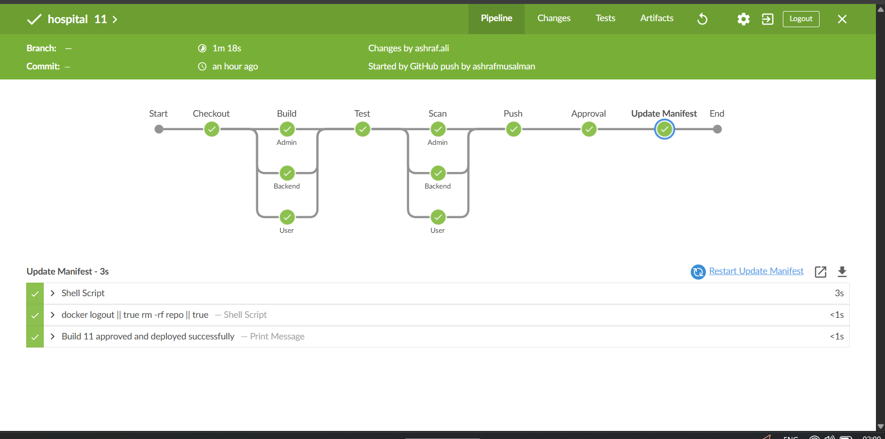 | 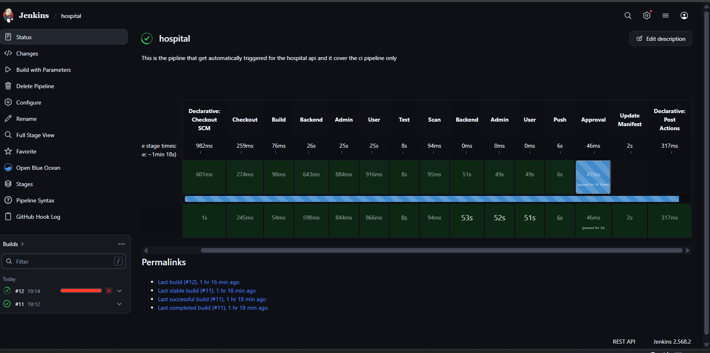 |

| ArgoCD — Resource Tree | ArgoCD — Resource List |
|---|---|
| 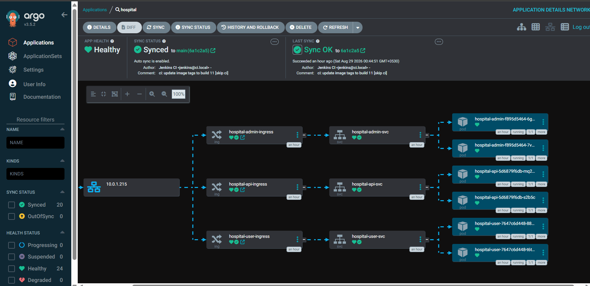 | 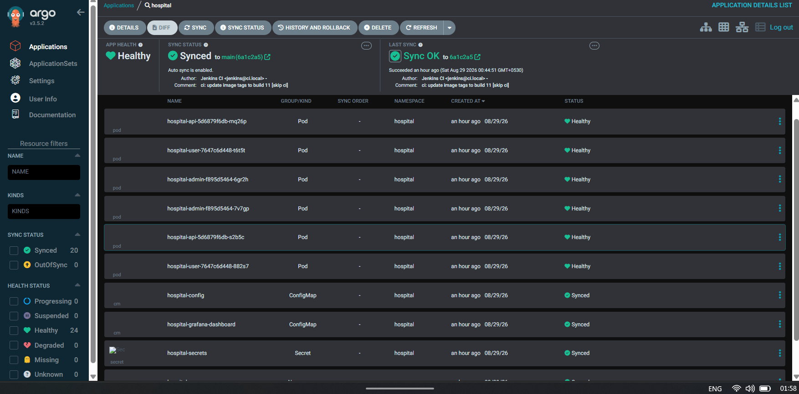 |

## Stack

- **Backend** — FastAPI, SQLAlchemy, Postgres, JWT auth
- **Frontend** — React 19, Vite, React Router, Framer Motion
- **Infra** — Docker Compose (dev), Kubernetes (prod), Terraform (AWS), Jenkins + ArgoCD (CI/CD)

## Project layout

```
apps/
  backend/          FastAPI — routers → services → repositories → models
  admin-portal/      Admin panel (React/Vite)
  patient-portal/     Patient-facing site (React/Vite)

infra/
  k8s/              Kubernetes manifests
  terraform/        AWS infrastructure (VPC, EC2, RDS)
  ci/               Jenkinsfile
  gitops/           ArgoCD application

compose.yaml        Local dev stack
```

## Running it locally

```bash
docker compose up -d --build
```

| Service | URL |
|---|---|
| Patient portal | http://localhost:5174 |
| Admin panel | http://localhost:5173 |
| API | http://localhost:8000 |

There's no signup for admins — create one with:

```bash
docker compose exec backend python -m apps.backend.seed_admin
```

Defaults to `admin@hospital.com` / `admin123` (override with `ADMIN_EMAIL` /
`ADMIN_PASSWORD`). Change these before pointing this at anything real.

`docker compose down` stops everything and keeps the Postgres volume.

### Environment variables

Copy `.env.example` to `.env` for any local, non-Docker work. The actual
values Compose uses live in `apps/backend/.env.local` (git-ignored):

```
DB_HOST=localhost
DB_PORT=5432
DB_NAME=hospitalData
DB_USER=postgres
DB_PASSWORD=your_password
SECRET_KEY=your_secret_key
```

`SECRET_KEY` signs JWTs — use a real random value outside of local dev.

One gotcha: `VITE_API_URL` is baked into the frontend at *build* time by
Vite, not read at container runtime. To point a frontend at a different
API, rebuild the image with a new `--build-arg`, not just a different env var.

## Backend

Layered as router → service → repository → model.

- `auth_router` — register, login, current user, profile
- `patient_router` — browse doctors, book/cancel appointments
- `admin/doctor_router`, `admin/appointment_router` — admin CRUD
- `homepage_router` — public homepage content, editable by admins

`GET /health` pings the database and backs the Kubernetes readiness probe.
`GET /metrics` is exposed for Prometheus.

## Deploying to Kubernetes

```bash
kubectl apply -R -f infra/k8s/
```

Needs Traefik (k3s's built-in ingress controller — nothing extra to
install for that) and ArgoCD already running in the cluster. Everything
lives under the `hospital` namespace, with a NetworkPolicy per pod —
frontends can only reach the API, the API can only reach Postgres, and
Postgres accepts connections from no one else.

Jenkins builds and pushes the three images on every push to `main`, updates
the image tags in `infra/k8s/`, and commits. ArgoCD watches that folder and
applies changes automatically — Jenkins never touches the cluster directly.

AWS infrastructure (VPC, EC2, RDS) is provisioned with Terraform under
`infra/terraform/`, applied in order: `bootstrap` → `network` → `app`.

`app` is a single node running **k3s** (a lightweight Kubernetes
distribution that bundles the control plane, kubelet, and container
runtime into one binary) rather than a separate kubeadm master + worker
— one right-sized box runs the control plane, Jenkins, the ingress
controller, and the app pods together, which is cheaper and avoids
needing a second EC2 instance's worth of AWS vCPU quota. This node sits
in the **public** subnet with a public IP — RDS is the only thing
actually isolated in the private subnets today; the app compute itself
is not, which is a known gap in the current setup, not a deliberate
security boundary.

Bring-up order once the Terraform above is applied:
1. SSH into `master` (`ssh ubuntu@<master_public_ip>`), install k3s
   (`curl -sfL https://get.k3s.io | sh -`) and Jenkins.
2. Install ArgoCD (it's not part of any Terraform/bootstrap automation —
   a one-time manual step):
   ```bash
   kubectl create namespace argocd
   kubectl apply -n argocd -f https://raw.githubusercontent.com/argoproj/argo-cd/stable/manifests/install.yaml
   ```
3. Register the app with ArgoCD: `kubectl apply -f infra/gitops/argocd/application.yaml`.
   ArgoCD then applies `infra/k8s` and rolls out the app on its own from
   then on — this one-time `kubectl apply` just tells it what to watch.
